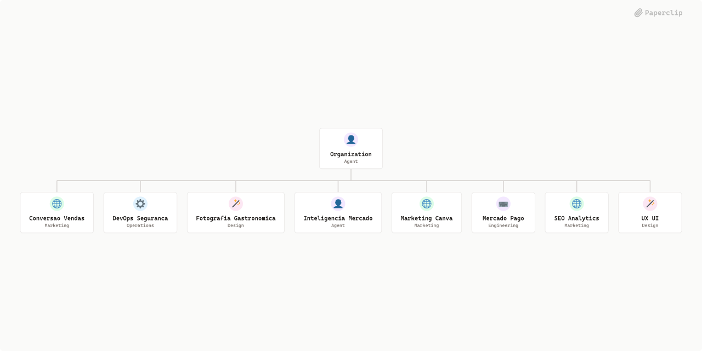

# Pizzaria Premium



## What's Inside

> This is an [Agent Company](https://agentcompanies.io) package from [Paperclip](https://paperclip.ing)

| Content | Count |
|---------|-------|
| Agents | 8 |
| Skills | 5 |
| Tasks | 1 |

### Agents

| Agent | Role | Reports To |
|-------|------|------------|
| Conversao Vendas | CMO | ceo-alexandre |
| DevOps Seguranca | devops | ceo-alexandre |
| Fotografia Gastronomica | designer | ceo-alexandre |
| Inteligencia Mercado | researcher | ceo-alexandre |
| Marketing Canva | CMO | ceo-alexandre |
| Mercado Pago | Engineer | ceo-alexandre |
| SEO Analytics | CMO | ceo-alexandre |
| UX UI | designer | ceo-alexandre |

### Skills

| Skill | Description | Source |
|-------|-------------|--------|
| paperclip-converting-plans-to-tasks | > | [github](https://github.com/paperclipai/paperclip/tree/master/skills/paperclip-converting-plans-to-tasks) |
| paperclip-create-agent | > | [github](https://github.com/paperclipai/paperclip/tree/master/skills/paperclip-create-agent) |
| paperclip-dev | > | [github](https://github.com/paperclipai/paperclip/tree/master/skills/paperclip-dev) |
| paperclip | > | [github](https://github.com/paperclipai/paperclip/tree/master/skills/paperclip) |
| para-memory-files | > | [github](https://github.com/paperclipai/paperclip/tree/master/skills/para-memory-files) |

## Getting Started

```bash
pnpm paperclipai company import this-github-url-or-folder
```

See [Paperclip](https://paperclip.ing) for more information.

---
Exported from [Paperclip](https://paperclip.ing) on 2026-06-18
